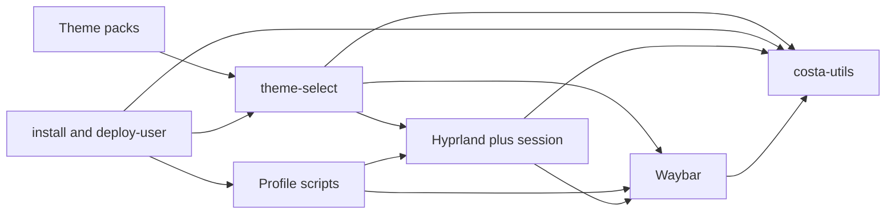

# Desktop interface contracts

Stable contracts between pieces of this monolithic installer. Paths are under
`$XDG_CONFIG_HOME` (default `~/.config`) unless noted. Changing a contract
requires updating this file, the implementing script, and the repository tests.



## 1. Theme pack schema

**Provider:** `~/.config/themes/<name>/`  
**Consumers:** `theme-select`, Waybar (via symlink), Hyprland, Kitty, Rofi, Dunst, GTK/Libadwaita, Hyprlock, Hyprpaper

### Required files

| Relative path | Consumer |
|---|---|
| `colors.css` | Waybar `@import` |
| `colors.lua` | Hyprland `require("current_colors")` |
| `lock.conf` | Hyprlock via `current_lock.conf` |
| `wallpaper.png` | Hyprpaper / Hyprlock |
| `gtk-4.0/gtk.css` | Libadwaita / costa-utils |
| `kitty-theme.conf` | Kitty |
| `rofi-theme.rasi` | Rofi |
| `dunstrc` | Dunst |

### Waybar CSS variables (`colors.css`)

Each pack must define these as `@define-color <name> #RRGGBB;`:

- `background`, `background-alt1`, `background-alt2`, `background-alt3`, `background-alt4`
- `foreground`, `foreground-dim`
- `soft-blue`, `soft-cyan`, `soft-green`, `soft-yellow`, `soft-peach`, `soft-lavender`, `soft-red`, `soft-grey`

### Libadwaita surfaces (`gtk-4.0/gtk.css`)

Each pack must declare at least these `:root` variables (and matching `@define-color` aliases):

- `--window-bg-color`, `--window-fg-color`
- `--view-bg-color`, `--view-fg-color`
- `--headerbar-bg-color`, `--headerbar-fg-color`
- `--sidebar-bg-color`, `--sidebar-fg-color`
- `--popover-bg-color`, `--popover-fg-color`
- `--accent-bg-color`, `--accent-fg-color`

### Hyprland colors (`colors.lua`)

Must begin with `hl.config({` and pass `luac -p` when `luac` is available.

## 2. theme-select

**Path:** `~/.config/scripts/theme-select`  
**Env:** `COSTA_THEME_RELOAD` ∈ `{0,1}` (default `1`)

### Inputs

- Theme directory `~/.config/themes/<name>/` satisfying the pack schema
- Optional `rofi` for interactive selection

### Outputs (stable consumer destinations)

All point through `~/.config/costa/current-theme/` before that pointer is
atomically retargeted:

| Destination | Pack member |
|---|---|
| `hypr/current_colors.lua` | `colors.lua` |
| `hypr/current_lock.conf` | `lock.conf` |
| `hypr/current_wallpaper.png` | `wallpaper.png` |
| `waybar/colors.css` | `colors.css` |
| `kitty/kitty-theme.conf` | `kitty-theme.conf` |
| `rofi/rofi-theme.rasi` | `rofi-theme.rasi` |
| `dunst/dunstrc` | `dunstrc` |
| `gtk-4.0/gtk.css` | `gtk-4.0/gtk.css` |

Also writes:

- `~/.config/costa/current-theme` → selected pack (atomic symlink)
- `hypr/hyprpaper.conf` using `current_wallpaper.png`
- `gtk-3.0/settings.ini` and `gtk-4.0/settings.ini` with `gtk-application-prefer-dark-theme=1`
- optional `gsettings … color-scheme prefer-dark` when a session bus exists

Does **not** mutate SDDM (`/usr/share`); that remains install-time only.

### Reload side effects (`COSTA_THEME_RELOAD=1`)

`hyprctl reload` · restart `hyprpaper` · reload/restart `waybar` and `dunst` ·
`SIGUSR1` to Kitty · `costa-utils --shutdown` · optional `notify-send`.

## 3. Waybar

**Paths:** `~/.config/waybar/{config.jsonc,modules,profile.jsonc,user.jsonc,style.css,colors.css}`

### Requires

```text
Files:   modules, profile.jsonc, user.jsonc, style.css, colors.css
Include: config.jsonc include = [modules, profile.jsonc, user.jsonc]
Theme:   colors.css defines the Waybar CSS variable set (section 1)
Profile: profile.jsonc supplies group/usage (vm vs bare-metal)
Binaries:
  ~/.local/bin/costa-utils with
    --app-menu | --power-menu | --network-menu | --bluetooth-menu
    | --volume-menu | --clipper | --blinker
Scripts:
  ~/.config/scripts/check_updates
  ~/.config/scripts/amd-gpu-stat   (bare-metal profile only)
Session: waybar.service PartOf=hyprland-session.target
```

### Profile contract

- `waybar-profile bare-metal|vm` copies `profile-<name>.jsonc` → `profile.jsonc`
- Writes `~/.config/costa/install-profile`
- VM profile must omit `custom/gpu`, `custom/vram`, and `temperature`

### Outputs

None. Reloaded by `theme-select`, `desktop-settings`, `waybar-profile`, or
`deploy-user` via `systemctl --user try-reload-or-restart waybar.service`.

## 4. Hyprland and session target

**Paths:** `hypr/hyprland.lua`, `hypr/{current_colors,monitors,input}.lua`,  
`systemd/user/hyprland-session.target`

### Lua requires

```lua
require("current_colors")  -- theme-select symlink
require("monitors")        -- monitor-select generated require
require("input")           -- desktop-settings generated
```

### Session `Wants=`

`dunst`, `hypridle`, `hyprpaper`, `hyprpolkitagent`, `hyprsunset`, `waybar`,
`cliphist-image`, `cliphist-text` (plus graphical-session-pre / xdg-desktop-autostart).

Hyprland starts the target after exporting Wayland/Hypr env to systemd, and
stops it on shutdown. Desktop helpers are supervised here, not `exec`'d from Lua.

### costa-utils binds

| Shortcut | Flag |
|---|---|
| `Super+V` | `--clipper` |
| `Super+P` | `--power-menu` |
| `Super+R` / Super release | `--app-menu` |
| `Print` | `--blinker` |

Window rule: class `^org\.fcosta\..*$` → float + center.

### Script binds

`Super+Alt+T/M/K` → `theme-select` / `monitor-select` / `desktop-settings`.

## 5. costa-utils CLI / D-Bus

**Binary:** `~/.local/bin/costa-utils` → `~/.local/share/costa-utils/costa_utils.py`  
**App id:** `org.fcosta.CostaUtils` (singleton; `--shutdown` quits for theme reload)

### Flags (dispatch surface)

`--app-menu`, `--runner`, `--blinker`, `--blinker-manager`, `--clipper`,
`--power-menu`, `--network-menu`, `--bluetooth-menu`, `--volume-menu`,
`--control-center`, `--shutdown`

Waybar and Hyprland must only call flags from this set. Theme GTK styling is
loaded from `~/.config/gtk-4.0/gtk.css` (section 1); the app does not read theme
packs directly.

### Runtime tools (feature → dependency)

| Feature | Tools |
|---|---|
| Clipper | `cliphist`, `wl-copy` (fed by cliphist user units) |
| Blinker | `grim`, `slurp`, `hyprctl`, `wl-copy` |
| Night light | `hyprctl hyprsunset` |
| Network / BT / audio | `nmcli`, BlueZ D-Bus, `wpctl` / PipeWire |

## 6. Profile and settings scripts

### `waybar-profile`

- **CLI:** exactly one of `bare-metal` \| `vm`
- **Writes:** `waybar/profile.jsonc`, `costa/install-profile`
- **Env:** `COSTA_WAYBAR_RELOAD` ∈ `{0,1}`

### `monitor-select`

- **CLI:** `single` \| `dual` (`dual-host` alias)
- **Requires:** `hypr/monitors/monitors-single.lua`, `monitors-dual-host.lua`
- **Writes:** `hypr/monitors.lua` → `require("monitors.monitors-<profile>")`

### `desktop-settings`

- **CLI:** `--keyboard LAYOUT`, `--clock 12h|24h`, `--show`
- **Writes:** `costa/desktop.env`, `hypr/input.lua`, `waybar/user.jsonc` (`clock.format`)

## 7. install / deploy-user layout

### Managed trees

| Kind | Destination |
|---|---|
| `CONFIG` | `~/.config/{dunst,hypr,kitty,rofi,scripts,systemd,themes,waybar}/` plus `mimeapps.list` |
| `DATA` | `~/.local/share/costa-utils/` (+ desktop entry / icons) |
| `BIN` | `~/.local/bin/costa-utils` |

Manifest: `~/.config/costa/managed-files` lines `KIND\trelative`. Deploy removes
only previous managed entries, then recopies. Env: `COSTA_DEPLOY_RELOAD`.

### Orchestration (deploy)

1. Optional `costa-utils --shutdown`
2. Manifest replace of managed trees
3. `daemon-reload` when reloading
4. `waybar-profile` from `costa/install-profile` or virt detection
5. Ensure `hyprland-session.target` if Hyprland is up
6. `theme-select <theme>` (default `fcosta`)

Install seeds the same layout, runs `desktop-settings` / `waybar-profile` /
`theme-select` with reload flags off, and syncs SDDM as root from the theme pack.
